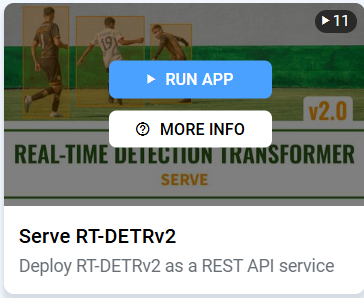
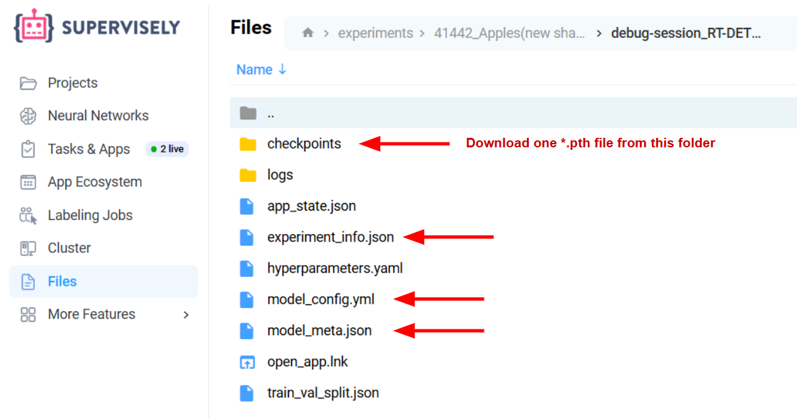

# Demo: Inference & Deployment

**Table of Contents (only for this readme):**

-   [Apply Model to your Project](#apply-model-to-your-project)
-   [Serve Model in Supervisely Platform](#serve-model-in-supervisely-platform)
-   [Inference via API](#inference-via-api)
-   [Using Model Outside of Supervisely Platform](#using-model-outside-of-supervisely-platform)
    -   [Get predictions in your code](#get-predictions-in-your-code)
    -   [Deploy model as a server on your machine](#deploy-model-as-a-server-on-your-machine)
    -   [Deploy in a Docker Container](#deploy-in-a-docker-container)
-   [Using Your Model as a Standalone PyTorch Model](#using-your-model-as-a-standalone-pytorch-model)

> You can use your model in very different ways depending on your needs. For more information, please, refer to our full [Inference & Deployment](https://docs.supervisely.com/neural-networks/overview-1) documentation.

## Once Click Model Predictions

Soon: run model inference on your data from experiemnt page.  
You can apply your model in a single click. Select the input project and datasets, configure inference settings if needed, and run the model.

_(We add this selector right into the page)_


> You can also get predictions with **Applying Apps**, such as [Apply NN to Images](https://ecosystem.supervisely.com/apps/nn-image-labeling/project-dataset) or [Apply NN to Video](https://ecosystem.supervisely.com/apps/apply-nn-to-videos-project). Read more in documentation [Apply Model in Platform](https://docs.supervisely.com/neural-networks/overview-1/supervisely-serving-apps#apply-model-in-platform).

## Serve Model in Supervisely Platform

To deploy a model on the platform, we use [Supervisely Serving Apps](https://docs.supervisely.com/neural-networks/overview-1/supervisely-serving-apps). For your model use the {Serve RT-DETRv2} Serving App:

_(Clickable widget)_



Alternatively, you can use [Supervisely SDK](https://github.com/supervisely/supervisely) to deploy the model on the platform:

```python
import os
import supervisely as sly
from dotenv import load_dotenv

# Ensure you've set API_TOKEN and SERVER_ADDRESS environment variables.
load_dotenv(os.path.expanduser("~/supervisely.env"))

api = sly.Api()

session = api.nn.deploy_custom_model(
  artifacts_dir="path/to/model",
  team_id=123,
  device="cuda",
)
```

> For more information, see [Deploy & Predict with Supervisely SDK](https://docs.supervisely.com/neural-networks/overview-1/deploy_and_predict_with_supervisely_sdk).

## Inference via API

Every Served Model on the platform is available via API. You can get predictions using our convenient inference `Session` class in Supervisely SDK. Here's an example:

```python
import os
import supervisely as sly
from dotenv import load_dotenv
from supervisely.nn.inference import Session

# Ensure you've set API_TOKEN and SERVER_ADDRESS environment variables.
load_dotenv(os.path.expanduser("~/supervisely.env"))

api = sly.Api()

# Create Inference Session, if you deployed a model manually.
task_id = 42  # ⬅ put your task_id from a platform
session = Session(api, task_id=task_id)

# Predict Image
prediction = session.inference_image_id(image_id=123)

# Predict Project
predictions = session.inference_project_id(project_id=456)
```

> For more information, see [Inference API Tutorial](https://docs.supervisely.com/neural-networks/inference-api).

---

## Using Model Outside of Supervisely Platform

### Get predictions in your code

This example shows how to load your checkpoint and get predictions in any of your code. You will need to clone our RT-DETRv2 repository and install dependencies. Then, you can load the model in your code and get predictions.

#### 1. Clone repository

Clone our [RT-DETRv2](https://github.com/supervisely-ecosystem/RT-DETRv2) fork with the model implementation.

```bash
git clone https://github.com/supervisely-ecosystem/RT-DETRv2
cd RT-DETRv2
```

#### 2. Set up environment

Install [requirements.txt](https://github.com/supervisely-ecosystem/RT-DETRv2/blob/main/rtdetrv2_pytorch/requirements.txt) manually, or use our pre-built docker image ([DockerHub](https://hub.docker.com/r/supervisely/rt-detrv2/tags) | [Dockerfile](https://github.com/supervisely-ecosystem/RT-DETRv2/blob/main/docker/Dockerfile)). Additionally, you need to install Supervisely SDK.

```bash
pip install -r rtdetrv2_pytorch/requirements.txt
pip install supervisely
```

#### 3. Download checkpoint

Download your checkpoint and model files from Team Files.



#### 4. Predict

Create `main.py` file in the root of the repository and paste the following code. This code will load the model, predict the image, and save the results to `./prediction.jpg`.

```python
import numpy as np
from PIL import Image
import os
import supervisely as sly
from supervisely.nn import ModelSource, RuntimeType

# Be sure you are in the root of the RT-DETRv2 repository
from supervisely_integration.serve.rtdetrv2 import RTDETRv2

# Put your path to image here
IMAGE_PATH = "sample_image.jpg"

# Model config and weights (downloaded from Team Files)
model_files = {
    "checkpoint": "model/rtdetrv2_r18vd_120e_coco_rerun_48.1.pth",
    "config": "model/rtdetrv2_r18vd_120e_coco.yml",
}

# JSON model meta with class names (downloaded from Team Files)
model_meta = sly.io.json.load_json_file("model/model_meta.json")

# Load model
model = RTDETRv2()
model.load_custom_checkpoint(
    model_files=model_files,
    model_meta=model_meta,
    device="cuda",
)

# Load image
image = Image.open(IMAGE_PATH).convert("RGB")
img = np.array(image)

# Predict
ann = model.inference(img, settings={"confidence_threshold": 0.4})

# Draw predictions
ann.draw_pretty(img)
Image.fromarray(img).save("prediction.jpg")
```

If you need to run the code in your project and not in the root of the repository, you can add the path to the repository into `PYTHONPATH`, or by the following lines at the beginning of the script:

```python
import sys
sys.path.append("/path/to/RT-DETRv2")
```

### Deploy model as a server on your machine

In this variant, you will deploy a model locally as an API Server with the help of Supervisely SDK. The server will be ready to process API request for inference. It allows you to predict with local images, folders, videos, or remote supervisely projects and datasets (if you provide your Supervisely API token).

#### 1. Clone repository

Clone our [RT-DETRv2](https://github.com/supervisely-ecosystem/RT-DETRv2) fork with the model implementation.

```bash
git clone https://github.com/supervisely-ecosystem/RT-DETRv2
cd RT-DETRv2
```

#### 2. Set up environment

Install [requirements](https://github.com/supervisely-ecosystem/RT-DETRv2/blob/main/rtdetrv2_pytorch/requirements.txt) manually, or use our pre-built docker image ([DockerHub](https://hub.docker.com/r/supervisely/rt-detrv2/tags) | [Dockerfile](https://github.com/supervisely-ecosystem/RT-DETRv2/blob/main/docker/Dockerfile)).

```bash
pip install -r rtdetrv2_pytorch/requirements.txt
pip install supervisely
```

#### 3. Download checkpoint

Download your checkpoint, model files and `experiment_info.json` from Team Files or the whole artifacts directory.


Place downloaded files in the folder within app repo. For example, create `models` folder inside root directory of the repository and place all files there.

Your repo should look like this:

```plaintext
📦app-repo-root
 ┣ 📂models
 ┃ ┗ 📂392_RT-DETRv2
 ┃   ┣ 📂checkpoints
 ┃   ┃ ┗ 🔥best.pth
 ┃   ┣ 📜experiment_info.json
 ┃   ┣ 📜model_config.yml
 ┃   ┗ 📜model_meta.json
 ┗ ... other app repository files
```

#### 4. Deploy

To deploy, run our `main.py` script to start the server. You need to pass the path to your checkpoint file. Like in the previous section, add the path to the {RT-DETRv2} repository into `PYTHONPATH`.

```bash
PYTHONPATH="${PWD}:${PYTHONPATH}" \
python ./supervisely_integration/serve/main.py deploy \
--model "./models/392_RT-DETRv2/checkpoints/best.pth"
```

This command will start the server on [http://0.0.0.0:8000](http://0.0.0.0:8000) and will be ready to accept API requests for inference.

#### 5. Predict

##### Predict via API

After the model is deployed, use Supervisely [Inference Session API](https://developer.supervisely.com/app-development/neural-network-integration/inference-api-tutorial) with setting server address to [http://0.0.0.0:8000](http://0.0.0.0:8000).

```python
import os
from dotenv import load_dotenv
import supervisely as sly

load_dotenv(os.path.expanduser("~/supervisely.env"))
api = sly.Api()

# Create Inference Session
session = sly.nn.inference.Session(api, session_url="http://0.0.0.0:8000")

# local image
prediction = session.inference_image_path("image_01.jpg")

# batch of images
predictions = session.inference_image_paths(["image_01.jpg", "image_02.jpg"])
```

##### Predict with CLI

Instead of using `Session`, you can deploy and predict in a single command.

```bash
PYTHONPATH="${PWD}:${PYTHONPATH}" \
python ./supervisely_integration/serve/main.py \
  predict "./image.jpg" \
  --model "models/392_RT-DETRv2/checkpoints/best.pth" \
  --device cuda \
  --settings confidence_threshold=0.4 \
  --output ./predictions
```

> For the full list of arguments, see the documentation [Deploy Model as a Server](https://docs.supervisely.com/neural-networks/overview-1/deploy_and_predict_with_supervisely_sdk#id-4.-deploy).

### Deploy in a Docker Container

Deploying in a Docker Container is similar to deployment as a Server. This example is useful when you need to run your model on a remote machine or in a cloud environment.

Use this `docker run` command to deploy your model in a docker container:

```bash
docker run \
  --runtime=nvidia \
  --env-file ~/supervisely.env \
  --env PYTHONPATH=/app \
  -v ".:/app" \
  -w /app \
  -p 8000:8000 \
  supervisely/rt-detrv2:1.0.14 \
  python3 supervisely_integration/serve/main.py deploy \
  --model "models/392_RT-DETRv2/checkpoints/best.pth"
```

To predict in the container, you can use `predict` action:

```bash
docker run \
  --runtime=nvidia \
  --env-file ~/supervisely.env \
  --env PYTHONPATH=/app \
  -v ".:/app" \
  -w /app \
  -p 8000:8000 \
  supervisely/rt-detrv2:1.0.14 \
  python3 supervisely_integration/serve/main.py \
  predict "./image.jpg" \
  --model "models/392_RT-DETRv2/checkpoints/best.pth" \
  --device cuda \
  --settings confidence_threshold=0.5 \
  --output ./predictions
```

> See more information in the [Deploy in Docker Container](https://docs.supervisely.com/neural-networks/overview-1/deploy_and_predict_with_supervisely_sdk#deploy-in-docker-container) documentation.

---

## Using Your Model as a Standalone PyTorch Model

Models trained in Supervisely can be used as a standalone PyTorch model (or ONNX / TensorRT) outside of the platform. This method completely decouple you from both Supervisely Platform and Supervisely SDK, and you will develop your own code for inference and deployment.

1. **Download** your checkpoint and model files from Team Files.

2. **Clone** our [RT-DETRv2](https://github.com/supervisely-ecosystem/RT-DETRv2) fork with the model implementation. Alternatively, you can use the original [RT-DETRv2](https://github.com/lyuwenyu/RT-DETR/tree/0b6972de10bc968045aba776ec1a60efea476165) repository, but you may face some unexpected issues if the authors have updated the code.

```bash
git clone https://github.com/supervisely-ecosystem/RT-DETRv2
cd RT-DETRv2
```

3. **Set up environment:** Install [requirements](https://github.com/supervisely-ecosystem/RT-DETRv2/blob/main/rtdetrv2_pytorch/requirements.txt) manually, or use our pre-built docker image ([DockerHub](https://hub.docker.com/r/supervisely/rt-detrv2/tags) | [Dockerfile](https://github.com/supervisely-ecosystem/RT-DETRv2/blob/main/docker/Dockerfile)).

```bash
pip install -r rtdetrv2_pytorch/requirements.txt
```

4. **Run inference:** Refer to our example scripts of how to load RT-DETRv2 and get predictions:

-   [demo_pytorch.py](https://github.com/supervisely-ecosystem/RT-DETRv2/blob/main/supervisely_integration/demo/demo_pytorch.py)
-   [demo_onnx.py](https://github.com/supervisely-ecosystem/RT-DETRv2/blob/main/supervisely_integration/demo/demo_onnx.py)
-   [demo_tensorrt.py](https://github.com/supervisely-ecosystem/RT-DETRv2/blob/main/supervisely_integration/demo/demo_tensorrt.py)

**demo_pytorch.py** is a simple example of how to load a PyTorch checkpoint and get predictions. You can use it as a starting point for your own code:

```python
import json
from PIL import Image, ImageDraw
import torch
import torchvision.transforms as T
from rtdetrv2_pytorch.src.core import YAMLConfig


device = "cuda" if torch.cuda.is_available() else "cpu"

# put your files here
checkpoint_path = "model/best.pth"
config_path = "model/model_config.yml"
model_meta_path = "model/model_meta.json"
image_path = "img/coco_sample.jpg"


def draw(images, labels, boxes, scores, classes, thrh = 0.5):
    for i, im in enumerate(images):
        draw = ImageDraw.Draw(im)
        scr = scores[i]
        lab = labels[i][scr > thrh]
        box = boxes[i][scr > thrh]
        scrs = scores[i][scr > thrh]
        for j,b in enumerate(box):
            draw.rectangle(list(b), outline='red',)
            draw.text((b[0], b[1]), text=f"{classes[lab[j].item()]} {round(scrs[j].item(),2)}", fill='blue', )


if __name__ == "__main__":

    # load class names
    with open(model_meta_path, "r") as f:
        model_meta = json.load(f)
    classes = [c["title"] for c in model_meta["classes"]]

    # load model
    cfg = YAMLConfig(config_path, resume=checkpoint_path)
    checkpoint = torch.load(checkpoint_path, map_location="cpu")
    state = checkpoint["ema"]["module"] if "ema" in checkpoint else checkpoint["model"]
    model = cfg.model
    model.load_state_dict(state)
    model.deploy().to(device)
    postprocessor = cfg.postprocessor.deploy().to(device)
    h, w = 640, 640
    transforms = T.Compose([
        T.Resize((h, w)),
        T.ToTensor(),
    ])

    # prepare image
    im_pil = Image.open(image_path).convert('RGB')
    w, h = im_pil.size
    orig_size = torch.tensor([w, h])[None].to(device)
    im_data = transforms(im_pil)[None].to(device)

    # inference
    output = model(im_data)
    labels, boxes, scores = postprocessor(output, orig_size)

    # save result
    draw([im_pil], labels, boxes, scores, classes)
    im_pil.save("result.jpg")
```
